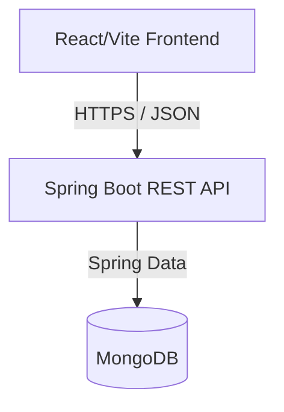

# CheckSy: Enterprise Task Manager
## Comprehensive Project Documentation

---

## 1. Project Overview
**CheckSy** is a full-stack, enterprise-grade task management application designed to help individuals manage their daily goals, tasks, and priorities. Unlike traditional rigid task managers, CheckSy employs a hand-drawn, sketched aesthetic with fluid micro-animations to make productivity engaging and intuitive.

**Objective:**
To build a scalable, secure, and highly interactive web application demonstrating modern architectural patterns (REST API, JWT Authentication, NoSQL Document storage, and Component-based UI).

---

## 2. System Architecture
The application follows a standard **Client-Server architecture** using the decoupled frontend-backend pattern.

- **Client Tier (Frontend):** React.js application responsible for UI rendering, state management, and user interactions.
- **Application Tier (Backend):** Java Spring Boot application exposing RESTful APIs, handling business logic, and security.
- **Data Tier (Database):** MongoDB (NoSQL) responsible for persistent data storage.



---

## 3. Technology Stack

### Frontend
- **Framework:** React.js (Bootstrapped with Vite for optimized builds)
- **Styling:** Tailwind CSS v4 (Utility-first CSS framework)
- **Animations:** Framer Motion (Declarative animations)
- **Routing:** React Router DOM
- **HTTP Client:** Axios (Configured with request interceptors for JWT injection)

### Backend
- **Framework:** Java Spring Boot 3.4
- **Security:** Spring Security & BCrypt Password Encoding
- **Tokenization:** JJWT (JSON Web Tokens)
- **Data Access:** Spring Data MongoDB
- **Build Tool:** Maven

### Database
- **System:** MongoDB (Locally hosted on port 27017)
- **Structure:** Schema-less document storage mapped via Spring Data `@Document`.

---

## 4. Key Features

1. **Authentication System:**
   - Full user registration and secure login.
   - **Guest Sessions:** One-click guest access that generates a temporary account with a 2-minute auto-expiry, ensuring data privacy and instant app exploration without commitment.
2. **Task Lifecycle Management:**
   - Create, Read, Update, and Delete (CRUD) tasks.
   - Tagging system for categorizing tasks.
   - Priority assignment (Low, Medium, High).
3. **Responsive & Dynamic UI:**
   - Dual viewing modes (List View & Block View).
   - Native Dark Mode toggle with global state propagation.
   - Custom sketched aesthetic mimicking real paper and ink.

---

## 5. Security Implementation

CheckSy utilizes **Stateless JWT Authentication**.

1. **Login/Register:** The user provides credentials to `/api/auth/login`.
2. **Token Generation:** Spring Security verifies the BCrypt hashed password. `JwtUtil` generates an HS256 signed token containing the `userId`.
3. **Storage:** The frontend stores the JWT in `localStorage`.
4. **Interception:** Every subsequent request via Axios automatically attaches `Authorization: Bearer <token>`.
5. **Validation:** `JwtAuthenticationFilter` intercepts incoming requests to `/api/tasks/**`, validates the token signature, and sets the Spring Security Context before allowing the request to proceed.

---

## 6. Database Schema (MongoDB)

### Collection: `users`
| Field | Type | Description |
|-------|------|-------------|
| `_id` | ObjectId | Unique identifier |
| `username` | String | User's display name |
| `email` | String | Unique email address |
| `password` | String | BCrypt hashed password |
| `isGuest` | Boolean | Flag identifying temporary guest accounts |
| `guestExpiry` | Date | Timestamp of when the guest session expires |

### Collection: `tasks`
| Field | Type | Description |
|-------|------|-------------|
| `_id` | ObjectId | Unique identifier |
| `userId` | String | Reference to the owner's User `_id` |
| `text` | String | The actual task description |
| `completed` | Boolean | Task completion status |
| `priority` | String | ENUM ('Low', 'Medium', 'High') |
| `tags` | Array[String] | List of custom categorization tags |

---

## 7. RESTful API Endpoints

### Auth Controller (`/api/auth`)
| Method | Endpoint | Description | Auth Required |
|--------|----------|-------------|---------------|
| `POST` | `/register` | Creates a new user account | No |
| `POST` | `/login` | Authenticates and returns JWT | No |
| `POST` | `/guest` | Generates a temporary guest account | No |

### Task Controller (`/api/tasks`)
| Method | Endpoint | Description | Auth Required |
|--------|----------|-------------|---------------|
| `GET` | `/` | Retrieves all tasks for the logged-in user | Yes |
| `POST` | `/` | Creates a new task | Yes |
| `PUT` | `/{id}` | Updates an existing task (text, priority, completion) | Yes |
| `DELETE` | `/{id}` | Deletes a task | Yes |

---

## 8. Setup & Installation

### Prerequisites
- Node.js (v18+)
- Java JDK 17+
- MongoDB instance running locally on port 27017

### Running the Backend
```bash
cd spring-backend
./mvnw clean install
./mvnw spring-boot:run
```
*The server will start on `http://localhost:8080`*

### Running the Frontend
```bash
npm install
npm run dev
```
*The client will start on `http://localhost:5173` (or alternative port if in use)*

---
*Documentation generated for the CheckSy project repository.*
